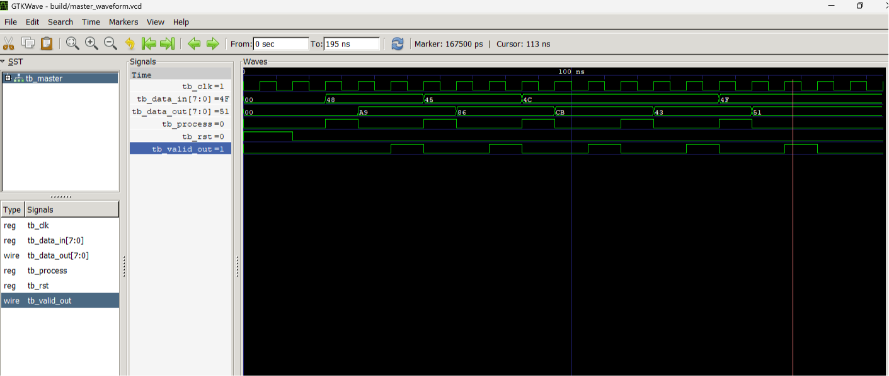

# Verilog-Digital-Logic-Lab
# FPGA Hardware Stream Cipher

This project implements a hardware stream cipher in Verilog. It uses a 16 bit Linear Feedback Shift Register to generate a pseudo random keystream. The design is modular and built for hardware level speed.

## Architecture overview

* Top level controller. A finite state machine coordinates the data flow and controls the encryption process.
* LFSR engine. The core uses a primitive polynomial to maximise cryptographic entropy and prevent short repeating loops.
* Datapath. The system slices the lower 8 bits of the LFSR output and XORs them with the incoming data byte.

## Verification

The system is fully tested using a master testbench. The simulation feeds an ASCII string into the chip. The waveform below proves that identical input letters produce completely different ciphertext. This confirms the hardware successfully defends against frequency analysis.



## Compilation and simulation

Run the following commands in your terminal to compile the hierarchical design and view the waveform.

```bash
iverilog -o build/master_sim.vvp hdl/crypto_accel.v hdl/lfsr16.v tb/tb_crypto_accel.v
vvp build/master_sim.vvp
gtkwave build/master_waveform.vcd